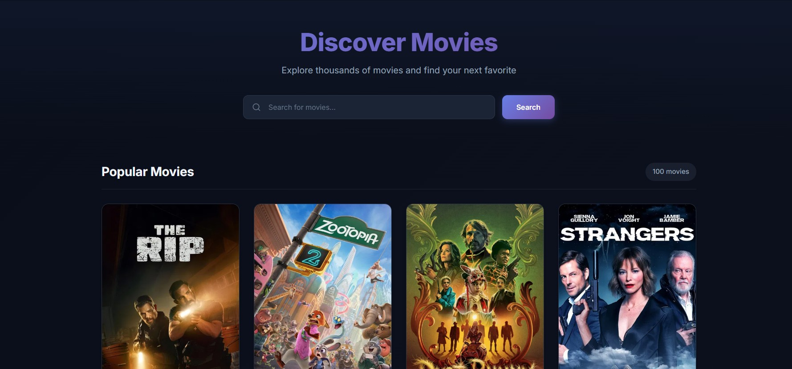
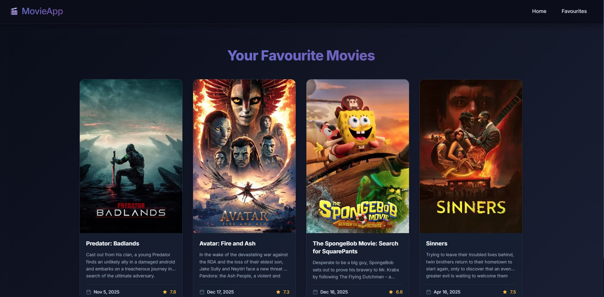
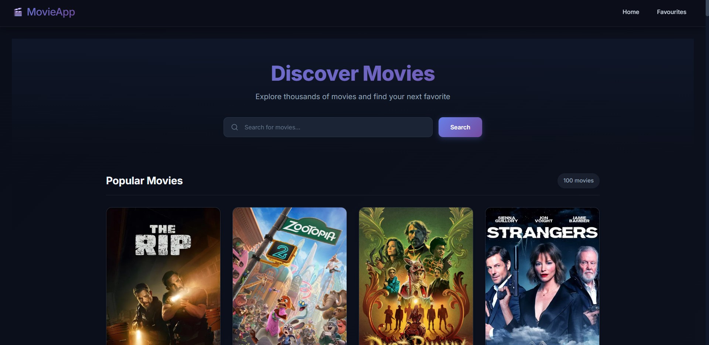

<h1 align="center"> 🎬 Popular Movies Discovery - React App </h1>

<p align="center">
   
   
   
</p>

<p align="center">
  
</p>

##  Overview 
A modern-looking movie discovery application built with React and The Movie Database (TMDB) API. Browse popular movies, search for your favorites, and create a personalized collection.
I made it while practicing React. 

##  Features

-  **Browse Popular Movies** - Discover trending and popular movies with beautiful card layouts
-  **Smart Search** - Search across multiple pages with real-time results
-  **Favorites System** - Save your favorite movies for quick access
-  **Responsive Design** - Works seamlessly on desktop, tablet, and mobile
-  **Modern UI** - Glass-morphism effects, smooth animations, and gradient accents
-  **Fast Performance** - Parallel API requests and optimized rendering
-  **Dark Theme** - Eye-friendly dark interface with purple gradient highlights


##  Demo & Screenshots

### 🌐 Public Pages
| Landing Page |
|--------------|
 |

| Favourites | Home |
|-------------|---------------|
|  |  |


##  Technologies Used

- **React 18** - Modern React with hooks
- **React Router** - Client-side routing
- **Context API** - State management for favorites
- **TMDB API** - Comprehensive movie database
- **CSS3** - Modern styling with animations and transitions
- **Vite** - Next-generation frontend tooling

##  Prerequisites

Before you begin, ensure you have the following installed:
- **Node.js** (v14 or higher) - [Download here](https://nodejs.org/)
- **npm** or **yarn** - Comes with Node.js
- **TMDB API Key** - [Get it free here](https://www.themoviedb.org/settings/api)

##  Installation

1. **Clone the repository**
   ```bash
   git clone https://github.com/LT-Ripjaws/react-movie-app.git
   cd react-movie-app
   ```

2. **Install dependencies**
   ```bash
   npm install
   # or
   yarn install
   ```

3. **Set up environment variables**
   
   Create a `.env` file in the root directory:
   ```env
   VITE_TMDB_API_KEY=your_api_key_here
   VITE_TMDB_BASE_URL=https://api.themoviedb.org/3
   ```

4. **Start the development server**
   ```bash
   npm run dev
   # or
   yarn dev
   ```

   make sure the api key is there in api.js file in services.

5. **Open your browser**
   
   Navigate to [http://localhost:5173](http://localhost:5173)

##  Getting Your TMDB API Key

1. Go to [TMDB website](https://www.themoviedb.org/)
2. Create a free account
3. Navigate to Settings → API
4. Request an API key (Developer)
5. Fill out the form (choose "Personal" if it's for learning)

###  License
This project is licensed under the MIT License

###  Project Status
 Active development – Version 1.0.0

## 👤 Author
*Chinmoy Guha*  

- GitHub: [@LT-Ripjaws](https://github.com/LT-Ripjaws)  
- Email: chinmoyguha676z@gmail.com
<p align="center">
  
</p>
<p align="center">  </p>
<p align="center">

</p>
